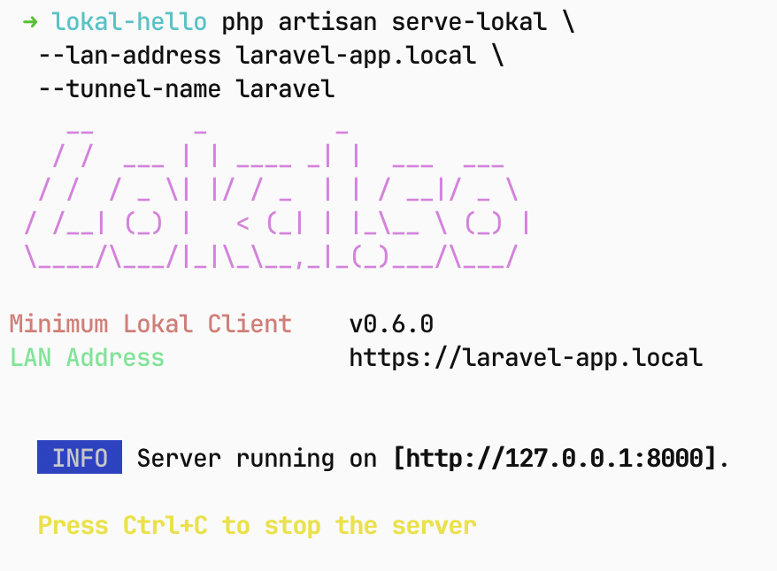
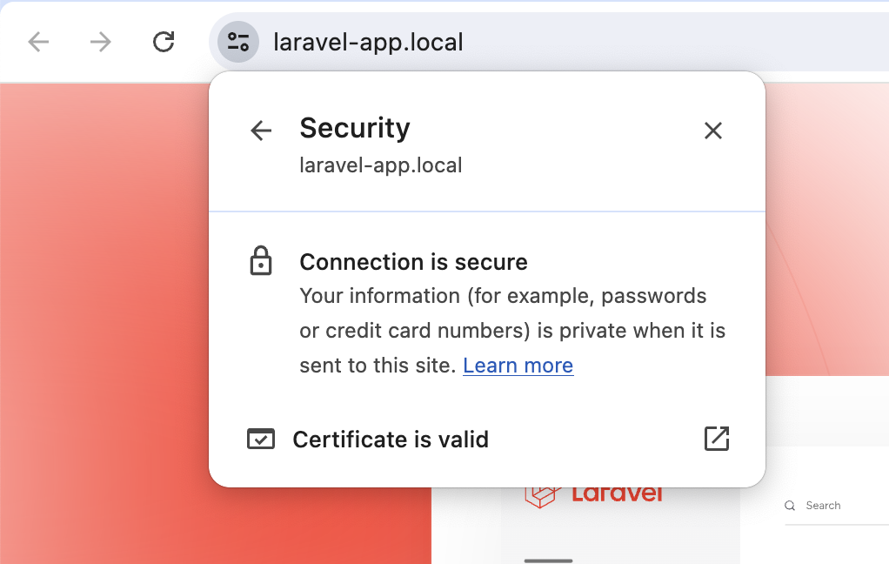

# Lokal PHP library

PHP Library for interacting with Lokal Client REST API.

| CLI Preview | Browser Preview |
|---|---|
|   |  |

*the screenshot are demonstrating [Lokal Laravel Provider](https://github.com/lokal-so/lokal-laravel-serve)*

```php
<?php

use LokalSo\Lokal;

$address = "127.0.0.1:8080";

$lokal  = new Lokal();
$tunnel = $lokal->newTunnel()
	->setName("laravel test")
	->setTunnelType(Lokal::TunnelTypeHTTP)
	->setLANAddress("laravel-backend.local")
	->setLocalAddress($address)
	->showStartupBanner()
	->ignoreDuplicate();

$ret = $tunnel->create();
```

## Installation

```sh
composer require lokal-so/lokal-php
```

## Development

```sh
git clone https://github.com/lokal-so/lokal-php.git;
cd lokal-php;
composer install -vvv;
php example.php;
```

## License

GPL-2.0-only

## Maintainer:

- Ammar Faizi <ammarfaizi2@gnuweeb.org>

-- 
Ammar Faizi
